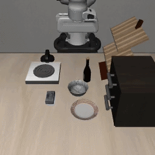
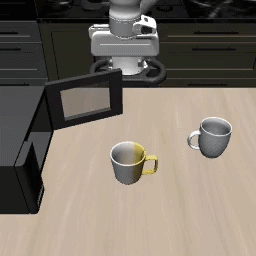

# SABER: Stealthy Agent-Based Adversarial Attack on VLA Models

[](https://arxiv.org/abs/2603.24935)
[](LICENSE)
[](https://www.python.org/downloads/release/python-3110/)

This repository is the codebase for our paper:

**SABER: A Stealthy Agentic Black-Box Attack Framework for Vision-Language-Action Models**

<p align="center">
  
</p>

SABER is a GRPO-trained ReAct attack agent that generates small, plausible adversarial instruction edits — using character-, token-, and prompt-level tools under a bounded edit budget — to degrade frozen **Vision-Language-Action (VLA)** policies in the **LIBERO** manipulation benchmark.

# About

- **Adversarial Robustness** of Vision-Language-Action Models
- **Reinforcement Learning** (GRPO) for attack agent training
- **Black-Box Attack** — no gradient through the victim VLA
- **Cross-Model Transfer** — attacks trained on Pi0.5 transfer to 5 other VLAs

# Table of Contents

- [About](#about)
- [Dependencies](#dependencies)
- [Installation](#installation)
- [Architecture](#architecture)
- [Running SABER](#running-saber)
  - [Training](#training)
  - [Evaluation](#evaluation)
  - [Cross-Model Transfer](#cross-model-transfer)
- [Results](#results)
- [Animations](#animations)
- [Directory Structure](#directory-structure)
- [Citation](#citation)

# Dependencies

- **PyTorch** (2.9.0, CUDA 12.8)
- **JAX** (0.5.3, CUDA 12)
- **vLLM** (0.13.0)
- **openpipe-art** (0.5.9) — ART framework for GRPO training
- **LIBERO** — manipulation benchmark
- **OpenPI** — Pi0.5 VLA model loader

**Note:** Different VLA models require different `transformers` versions. The framework handles this automatically via per-model conda environments and subprocess isolation — see [Installation](#installation).

# Installation

### Quick install (recommended)

```bash
# Clone LIBERO first (alongside this repo)
git clone https://github.com/Lifelong-Robot-Learning/LIBERO.git ../LIBERO

# One-command install (creates conda env "vast" with Python 3.11)
bash installation/install.sh
```

Options:

```bash
bash installation/install.sh myenv              # custom env name
bash installation/install.sh vast --skip-conda  # skip conda create
LIBERO_ROOT=/path/to/LIBERO bash installation/install.sh  # custom LIBERO path
```

### Manual install

For step-by-step control, see **[INSTALL.md](INSTALL.md)**.

```bash
conda create -n vast python=3.11 -y && conda activate vast
pip install torch==2.9.0 torchvision==0.24.0 --index-url https://download.pytorch.org/whl/cu128
pip install "numpy>=2" "jax[cuda12]==0.5.3"
pip install -r requirements.txt
pip install -e ../LIBERO --no-deps
python installation/apply_vllm_patches.py
```

### VLA model environments

Each victim VLA runs in its own conda env (handled automatically by `model_factory.py`):

```bash
bash installation/setup_vla_envs.sh              # all envs
bash installation/setup_vla_envs.sh vla_models   # OpenVLA, ECoT, DeepThinkVLA
bash installation/setup_vla_envs.sh vla_molmoact # MolmoAct
bash installation/setup_vla_envs.sh vla_internvla # InternVLA-M1
```

### Verify

```bash
conda activate vast
python installation/check_libero_env.py
```

# Architecture

<p align="center">
  
</p>

SABER consists of three components:

1. **Attack Agent** (Qwen2.5-3B-Instruct + LoRA) — a LangGraph ReAct agent that selects and applies perturbation tools.
2. **Tool Families** — character-level typos, token-level replacements, and prompt-level clause injections, each following a FIND → APPLY pattern.
3. **Reward Function** — objective-specific signal from the VLA rollout (task failure / action inflation / constraint violation) plus a stealth penalty.

| Tool Family | FIND Phase | APPLY Phase |
|-------------|-----------|-------------|
| **Token** | `find_targets` — identify vulnerable tokens | `apply_replace`, `apply_remove`, `apply_add`, `apply_swap` |
| **Char** | `find_char_targets` — locate character positions | `apply_add_char`, `apply_remove_char`, `apply_alter_char`, `apply_swap_chars` |
| **Prompt** | `find_prompt_targets` — select injection type | `apply_verify_wrap`, `apply_decompose_wrap`, `apply_uncertainty_clause`, ... |

### Attack objectives

| Objective | Rewarded Behavior | Task-Success Gate |
|-----------|-------------------|-------------------|
| `task_failure` | VLA fails the task (baseline succeeded) | No |
| `action_inflation` | VLA uses excess steps (still succeeds) | Yes |
| `constraint_violation` | Extra collisions, joint-limit hits, contact force | No |

# Running SABER

### Training

Train the attack agent via GRPO against Pi0.5 in LIBERO:

```bash
python train_vla.py --objective task_failure --task_suite libero_spatial --task_ids 0,1,2
```

Or use the parameterised training script:

```bash
bash scripts/run_train.sh task_failure              # default
bash scripts/run_train.sh action_inflation
bash scripts/run_train.sh constraint_violation
```

For a **lightweight test** (one task, one episode):

```bash
python train_vla.py \
  --objective task_failure \
  --task_suite libero_spatial \
  --task_ids 0 \
  --episodes_per_task 1 \
  --groups_per_step 1 \
  --trajectories_per_group 1 \
  --num_epochs 1
```

See **[RUN.md](RUN.md)** for troubleshooting, GPU configuration, and single-GPU runs.

### Evaluation

Evaluate the trained attack agent against any victim VLA:

```bash
bash scripts/run_eval_attack.sh task_failure                 # all models
bash scripts/run_eval_attack.sh task_failure openvla ecot    # specific models
```

Evaluate baselines (no attack):

```bash
bash run_eval_baseline_all_vlas.sh
```

### Cross-Model Transfer

Attacks trained on Pi0.5 can be **replayed** on other VLAs without the attack agent (1 GPU only):

**Step 1 — Record** attack prompts from source model:

```bash
bash scripts/run_record.sh task_failure openpi_pi05
```

**Step 2 — Replay** on victim models:

```bash
bash scripts/run_eval_replay.sh --victim openvla \
  --record outputs/agent_output_records_task_failure_2/task_failure_openpi_pi05.json

bash scripts/run_eval_replay.sh --all-victims \
  --record outputs/agent_output_records_task_failure_2/task_failure_openpi_pi05.json
```

**Step 3 — Aggregate** cross-model results:

```bash
python aggregate_replay_results.py --results_dir outputs/eval_result
```

# Results

<p align="center">
  
</p>

On six VLA models across three attack objectives, SABER achieves:

| Metric | SABER |
|--------|-------|
| Task success reduction | **20.6%** |
| Action inflation | **55%** more steps |
| Constraint violations | **33%** increase |
| Tool calls (vs GPT baseline) | **21.1% fewer** |
| Character edits (vs GPT baseline) | **54.7% fewer** |

### Supported VLA models

| Model | Architecture | Action Horizon |
|-------|-------------|---------------|
| **Pi0.5** | OpenPI flow-matching (JAX) | 10 |
| **OpenVLA** | OpenVLA-7B per-suite (HF) | 1 |
| **ECoT** | OpenVLA + Chain-of-Thought | 1 |
| **DeepThinkVLA** | PaliGemma + CoT + RL, 4-bit | 10 |
| **MolmoAct** | Molmo + action parsing | 1 |
| **InternVLA-M1** | Qwen2.5VL + DINOv2 + DiT | 8 |

# Animations

We compare **baseline** (clean instruction) vs **attack** (SABER-perturbed instruction) rollouts on LIBERO tasks. In each pair, the baseline succeeds while the attack causes the VLA to fail.

### Task Failure — Example 1

| Baseline (Success) | Attack (Failure) |
|:-------------------:|:----------------:|
|  |  |

### Task Failure — Example 2

| Baseline (Success) | Attack (Failure) |
|:-------------------:|:----------------:|
|  |  |

### Task Failure — Long-Horizon Task

| Baseline (Success) | Attack (Failure) |
|:-------------------:|:----------------:|
|  |  |

# Directory Structure

```
agent_attack_framework/
├── agent/                     # Attack agent logic
│   └── vla_rollout.py         # VLA attack rollout (LangGraph ReAct)
├── tools/                     # Adversarial perturbation tools
│   ├── token_attack.py        # Token-level: replace / remove / add / swap
│   ├── char_attack.py         # Character-level: typo-style edits
│   ├── prompt_attack.py       # Prompt-level: clause & sentence injection
│   └── visual_attack.py       # Visual: patch, pixel, color, spatial
├── rwd_func/                  # Reward functions
│   ├── rwd.py                 # 3 objectives + stealth penalty
│   └── metrics.py             # Evaluation metrics
├── libero_rollouts/           # VLA model wrappers
│   ├── model_factory.py       # Unified VLA loader (per-model env routing)
│   ├── pi05_libero_model.py   # Pi0.5 wrapper (JAX)
│   ├── openvla_wrapper.py     # OpenVLA wrapper
│   ├── ecot_wrapper.py        # ECoT wrapper
│   ├── deepthinkvla_wrapper.py  # DeepThinkVLA wrapper
│   ├── molmoact_wrapper.py    # MolmoAct wrapper
│   └── internvla_wrapper.py   # InternVLA-M1 wrapper
├── eval/                      # LIBERO evaluation suite
├── cold_start/                # Cold-start trajectory collection (GPT-5 Mini)
├── scripts/                   # Training and evaluation scripts
│   ├── run_train.sh           # GRPO training launcher
│   ├── run_record.sh          # Record attack prompts
│   ├── run_eval_attack.sh     # Live attack evaluation
│   └── run_eval_replay.sh     # Replay evaluation
├── installation/              # Setup, patches, environment scripts
│   ├── install.sh             # One-command installer
│   ├── setup_vla_envs.sh      # Per-model conda env creation
│   ├── apply_vllm_patches.py  # ART/vLLM patches
│   └── check_libero_env.py    # Environment verification
├── train_vla.py               # Main training entry point
├── eval_attack_vla.py         # Live attack evaluation
├── eval_baseline_vla.py       # Baseline evaluation (no attack)
├── eval_replay_attack.py      # Replay evaluation
├── requirements.txt
├── INSTALL.md                 # Detailed installation guide
├── RUN.md                     # Running guide and troubleshooting
└── README.md
```

# Citation

```bibtex
@article{wu2025saber,
  title={SABER: A Stealthy Agentic Black-Box Attack Framework for Vision-Language-Action Models},
  author={Wu, Xiyang and others},
  journal={arXiv preprint arXiv:2603.24935},
  year={2025}
}
```
